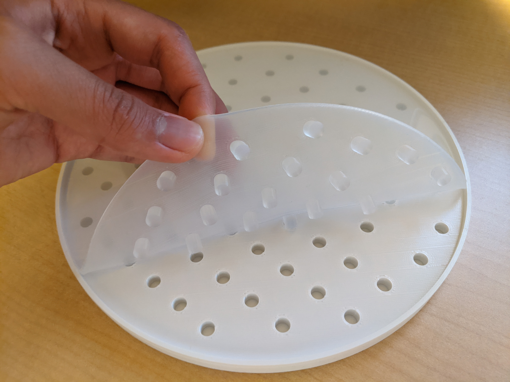

# Open-Source Nutator

This repository is a ‘fork’ of a project by Dhwani K. Trivedi and Joshua M. Pearce from Michigan Technological University. The original project is not on GitHub, but is instead hosted [here](https://osf.io/bqysc/), on the Open Science Framework. A published paper that describes the original project can found [here](https://www.academia.edu/34589801/Open_Source_3_D_Printed_Nutating_Mixer) or [here](docs/trivedi_pearce_2017.pdf). I am ‘forking’ their project into this repository because I prefer GitHub for version control and open sourcing. 

In this repository, I detail some of the various modifications I made to build this project. For all 3D-printed parts, I used a [Prusa MK3s](https://shop.prusa3d.com/en/3d-printers/180-original-prusa-i3-mk3s-kit.html?gclid=Cj0KCQjwutaCBhDfARIsAJHWnHvx8k-mshW_x2fmi0MGLbitysPgBX_iFMeMSdHa64Brgxne7ESQhUUaAvccEALw_wcB). `.3mf` files for all parts can be found [here](hardware/3MF_prusa_slicer_files/). 

1. Two components are printed with a flexible filament, such as TPU: the dimpled mat and the slit. The original project recommends NinjaFlex, which is an extremely soft type of TPU. NinjaFlex, however, is an absolute pain to print; the softer the material, the more difficult it is to print. I **do *not* recommend printing with NinjaFlex yourself **.  Rather, I suggest the following alternatives:
   
   1. I recommend getting the slit made at a 3rd party vendor. I found that [Protolabs ](https://www.protolabs.com/services/3d-printing/polyjet/design-guidelines/) was one of the few manufacturers that could make the part out of PolyJet, with a Shore hardness of 30A.  The pricing is also affordable.
   2. I recommend printing a *negative* of the dimpled mat using PLA, and then filling that negative with 2-part silicone. I found this method to be very easy and affordable, and the silicone-making process is completely safe. A photo of the finished product is attached below:
      
   
2. The reason the slit component must be printed with the softest possible TPU is because the rod piece “leans” into it, while the rod rotates via the motor and skateboard bearing. The extent to which the rod leans into the slit is greatest when the rod points in the same direction as the slit’s long axis. By this logic, the **rod should be printed with the highest possible strength**, so that it doesn’t snap during the nutator’s operation. Adjust the slicer settings for the rod such that both the infill and the perimeter values are high. The attached [`rod.3mf`](hardware/3MF_prusa_slicer_files/rod.3mf) file provides settings for Prusament PLA; the material can be easily adjusted. If you want to be really excessive, you can send the rod component to a 3rd party service like [Shapeways](https://www.shapeways.com/), and have it printed in something like [steel](https://www.shapeways.com/materials/steel/), for 40 USD or so (see the final note on pricing)

3. I adjusted the orientations of some of the 3D-printed components, and added supports when appropriate. The `.3mf` files contain all the slicer information, and are superior to `.stl` file types. See [this informative video](https://www.youtube.com/watch?v=BABdR9d8Cp4&ab_channel=Prusa3DbyJosefPrusa) for more details on `.3mf` vs `.stl`. 

4. I replaced some of the original materials from the BOM because I had difficulty finding some of the listed components—most of which were from Amazon. The commercial parts I used are:

   | Part                 | Source                                                       | Price (USD)                     | Notes                                                        |
   | -------------------- | ------------------------------------------------------------ | ------------------------------- | ------------------------------------------------------------ |
   | DPDT switch          | DigiKey [CKN11630-ND](https://www.digikey.com/en/products/detail/c-k/7201J26ZBE22/3729342?s=N4IgTCBcDaIMYGsB2BGFA2AzABgLRIBMQBdAXyA) | 14.07                           | I couldn’t find the DPDT switch linked in the original article. This switch from DigiKey is pricey, but it’s been tested for 100 000 cycles at full load, and more importantly, I like the tactile feel of paddle switches. Pretty much any switch with 20.32mm x 12.70mm panel cutuout dimensions should work. [Here](https://www.digikey.com/en/products/filter/rocker-switches/195?s=N4IgjCBcoOwBwGYqgMZQGYEMA2BnApgDQgD2UA2iAgJwAsYADDCALrEAOALlCAMqcAnAJYA7AOYgAvtKA) are the DigiKey search results, given the dimensions. Any of those switches should work. |
   | DC female power jack | Amazon ASIN [B01N8VV78D](https://www.amazon.com/gp/product/B01N8VV78D/ref=ppx_od_dt_b_asin_title_s00?ie=UTF8&psc=1) | 7.99 / 12                       | I found the dimensions of these 2.1 mm panel-mounted female DC power jack sockets to work perfectly. I might need to replace these parts in the future with something that can be more reliably sourced. |
   | Skateboard bearing   | Amazon ASIN [B08DDJBJVH](https://www.amazon.com/gp/product/B077FN9ZNT/ref=ppx_yo_dt_b_search_asin_title?ie=UTF8&psc=1) | 24.99 / 10                      | Any 608 skateboard bearings should work.                     |
   | DC motor             | Amazon ASIN [B01N1JQFYX](https://www.amazon.com/gp/product/B01N1JQFYX/ref=ppx_yo_dt_b_asin_title_o08_s00?ie=UTF8&psc=1) | 15.49                           | This 12 V worm gear motor is the exact model that the original project recommends. This motor can still be sourced from Amazon USA as of 2021-03-20. |
   | M3 screws            | McMaster-Carr [91290A111](https://www.mcmaster.com/91290A111/) and  McMaster-Carr [ 91290A115](https://www.mcmaster.com/91290A115/) | 8.71 / 100 x 4 + 7.71 / 100 x 3 | For the M3 screws, I used 6 mm long screws for everything except when securing the bearing holder to the motor shaft, and the the cover to the base. For those parts, I used 10 mm long screws. |
   | M3 nuts              | McMaster-Carr  [90592A085](https://www.mcmaster.com/90592A085/) | 0.88 / 100 x 5                  | Regular M3 nuts.                                             |

   Estimated total cost, not including 3D printer filament, is: **$33.35 USD**. 

5. Out of laziness, I opted not to redesign any of the 3D-printed parts. All the parts seem fine for the most part, but the one thing that annoys me is that for the 3D-printed base, the parts that hold the nuts to secure the cover are quite large. I would shrink the perimeters of the nut-securing insets, such that they’re more or less exactly the dimensions of the nut, and then I’d pull the nut in with a screw from the opposite side, to establish a captive nut. See step 9 of [this article](https://help.prusa3d.com/en/guide/1-introduction_54032) for an explanation. In the meantime, a careful dab of hot glue works fine. 

6. I generated an [alternative mat](hardware/3MF_prusa_slicer_files/flex_dimpled_mat_beetles_flies.3mf) for the nutator that features a contentious message for some researchers in the biological sciences. 

7. Some additional upgrades that can be made to the nutator include:

   - Adding a cheap ready-made PWM circuit. Tons of varieties are available on Amazon. 
   - Attaching some kind of microcontroller, such as one that can connect to the internet (some kind of ESP module), so that timers can be set from a phone app. 
   - Attaching some kind of sensor that checks that the motor is rotating. We can use something as simple as a reed switch that triggers every set period. If the reed switch fails to change state before the set period, then some kind of message can be sent to some phone app, to inform the user. 
   - Preparing parts so that the nutator can be used in a 4 C fridge. I might seal exposed electronics with something like heat shrink wrap and UV-curable glue, and opt for corrosion-resistant screws, like the [92290A1XX](https://www.mcmaster.com/screws/socket-head-screws/socket-head-screws-6/super-corrosion-resistant-316-stainless-steel-socket-head-screws/system-of-measurement~metric/thread-size~m3/) series screws from McMaster (where XX is 09 to 31). Some parts, like the internals of the DC motor, might preclude straightforward protection from extreme humidity. Room temperature operation is probably ideal. 

Some of the above changes I made or suggested increase the price of the nutator. Commercial scientific nutators, however, begin at something like [500 USD](https://www.thomassci.com/Equipment/Ambient-Temperature-Shakers/_/Nutating-3D-Platform-Mixer-Nutating-3D-shaker-with-dimpled-rubber-mat?q=Nutator), so making a few ‘premium’ upgrades doesn’t really merit a cost-benefit analysis. 

As of 2021-03-21, I’ve continuously rotated the nutator for __ hours, and then stopped, out of boredom.  